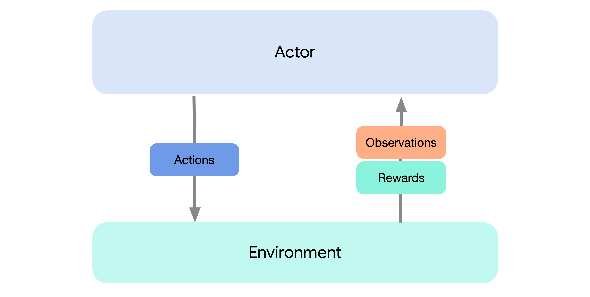
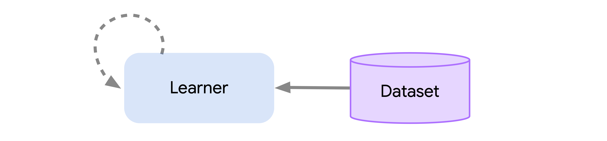

# Overview

The design of Acme attempts to provide multiple points of entry to the RL
problem at differing levels of complexity. The first entry-point &mdash; and
easiest way to get started &mdash; is just by running one of our
[baseline agents](agents.md). This can be done simply by connecting an agent (or
actor) instance to an environment using an environment loop. This instantiates
the standard mode of interaction with an environment common in RL and
illustrated by the following diagram:



This setting should, of course, look familiar to any RL practitioner, and with
this you can be up and running an Acme agent within a few lines of code.
Environments used by Acme are assumed to conform to the
[DeepMind Environment API][dm_env] which provides a simple mechanism to both
reset the environment to some initial state as well as to step the environment
and produce observations.

[dm_env]: https://github.com/deepmind/dm_env

Actors in Acme expose three primary methods: `select_action` which returns
actions to be taken, `observe` which records observations from the environment,
and an `update` method. In fact, by making use of these methods, the
`EnvironmentLoop` illustrated above can be roughly approximated by

```python
while True:
  # Make an initial observation.
  step = environment.reset()
  actor.observe_first(step.observation)

  while not step.last():
    # Evaluate the policy and take a step in the environment.
    action = actor.select_action(step.observation)
    step = environment.step(action)

    # Make an observation and update the actor.
    actor.observe(action, next_step=step)
    actor.update()
```

> NOTE: Currently in Acme the default method for observing data we make use of
> utilizes of observe/observe_last methods (reverse of the above). This is being
> phased out in favor of the above, which will soon be made the default.

Internally, agents built using Acme are written with modular _acting_ and
_learning_ components. By acting we refer to the sub-components used to generate
experience and by learning we are referring to the process of training the
relevant action-selection models (typically neural networks). An illustration of
this breakdown of an agent is given below:


Superficially this allows us to share the same experience generating code
between multiple agents. More importantly this split greatly simplifies the way
in which distributed agents are constructed.

Distributed agents are built using all of the same components as their
single-process counterparts, but split so that the components for acting,
learning, evaluation, replay, etc. each run in their own process. An
illustration of this is shown below, and here you can see that it follows the
same template as above, just with many different actors/environments:


This greatly simplifies the process of designing a novel agent and testing
existing agents where the differences in scale can be roughly ignored. This even
allows for us to scale all the way down to the batch or offline setting wherein
there is no data generation process and only a fixed dataset:



Finally, Acme also includes a number of useful utilities that help keep agent
code readable, and that make the process of writing the next agent that much
easier. We provide common tooling for these components ranging from
checkpointing to snapshotting, various forms of logging, and other low-level
computations. For more information on these components, as well as the structure
described above, see our more detailed discussion of Acme
[components](components.md) or take a look at implementations of a specific
[agents](agents.md).
